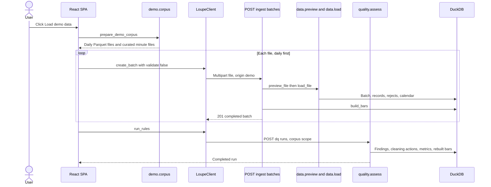

# CLG26: from source files to the screen

This is one concrete, reproducible journey through Loupe. It follows the real
`CLG26` minute and daily files into DuckDB, derives the numbers returned by
FastAPI, and ends at the charts the React app draws.

The worked session is **trade date 2025-12-17**. It is useful because the minute
tape contains all 1,380 expected slots, both grains are present, and the
minute-derived bar can be compared with the vendor's supplied daily bar.

All values below come from the pinned vendor corpus, revision
`29efdfa21c5a5b2d7aa306397385cf116e011559`. Chart shapes in the UI mocks are
schematic; every printed number is real.

This is a primer, not a second specification. Calculation truth lives in
[`specs/analytics-semantics.md`](../specs/analytics-semantics.md), storage truth
in [`specs/data-model.md`](../specs/data-model.md), and page behavior in
[`specs/loupe-ui-design.md`](../specs/loupe-ui-design.md).

---

## 1. The result first

For the same contract and trade date, Loupe holds two legitimate daily bars:

| Source selected by Quality grain | Open | High | Low | Close | Volume | Meaning of close |
|---|---:|---:|---:|---:|---:|---|
| Minute → derived | 55.08 | 56.81 | 55.08 | **56.74** | **185,717** | Last minute trade |
| Daily → supplied | 55.08 | 56.81 | 55.08 | **55.81** | **339,135** | Vendor settlement |

The open, high, and low agree. The close differs by `+0.93`, and the minute
tape contains `54.76%` of supplied daily volume:

```text
close difference = 56.74 - 55.81 = +0.93
volume ratio      = 185,717 / 339,135 = 0.5476
```

That difference is not silently "fixed." A settlement is not required to equal
the final minute trade, and the vendor's daily volume can include activity that
never appeared on this tape.

One point on the other chart is equally traceable. At
**2025-12-17 08:30 CT** (`14:30Z`), the trailing typical-price VWAP is:

```text
weighted numerator = 310,987.693333
window volume      =       5,559
VWAP               = 310,987.693333 / 5,559
                   =      55.943100078
```

The rest of this document shows where those numbers came from.

---

## 2. The whole path

```mermaid
flowchart LR
  subgraph sourceFiles [Pinned vendor files]
    MinuteParquet["CLG26 minute Parquet"]
    MinuteCSV["CLG26.csv, lossless demo conversion"]
    DailyParquet["CLG26 daily Parquet"]
  end

  subgraph ingestLayer [Preview and ingest]
    Preview["preview_file: mapping, grain, zone, boundary"]
    Load["load_file: parse and canonicalize"]
  end

  subgraph duckdb [DuckDB]
    Batch["stage.ingest_batch: decisions and provenance"]
    Stage["stage.market_record: immutable accepted rows"]
    Rejects["stage.record_reject: unparseable rows"]
    Findings["dq.dq_finding: quality evidence"]
    Clean["dq.market_record_clean: derived clean basis"]
    Bars["mart.bar_daily: derived and vendor bars"]
  end

  subgraph publish [Publish]
    Insights["insights: bars and VWAP"]
    API["FastAPI /v1: JSON envelopes"]
    Client["LoupeClient: HTTP only"]
    Web["React Review: cards and charts"]
  end

  MinuteParquet -->|"converted once for CSV coverage"| MinuteCSV
  MinuteCSV --> Preview
  DailyParquet --> Preview
  Preview --> Load
  Load --> Batch
  Load --> Stage
  Load --> Rejects
  Stage --> Findings
  Findings --> Clean
  Stage --> Bars
  Clean --> Bars
  Clean --> Insights
  Bars --> Insights
  Insights --> API
  Findings --> API
  API --> Client
  Client --> Web
```



The source locations after **Load demo data** are:

- minute vendor file:
  `data/samples/data/minute/NYMEX/CL/CLG26.parquet`
- minute CSV actually loaded by the demo:
  [`data/demo/CLG26.csv`](../data/demo/CLG26.csv)
- daily vendor file:
  `data/samples/data/daily/NYMEX/CL/CLG26.parquet`

The fetched vendor files are gitignored. Loupe converts this minute file to CSV
because it is the earliest curated minute file. The CSV replaces—not
supplements—the equivalent Parquet in the demo load, preventing every row from
appearing twice.

The two source files contain:

| Grain | Rows | Held range | Source fields used here |
|---|---:|---|---|
| Minute | 105,384 | 2020-12-03 09:19 CT → 2026-01-20 13:29 CT | contract, Chicago wall clock, OHLCV |
| Daily | 2,012 | 2018-01-22 → 2026-01-20 | contract, session date, OHLCV, open interest |

---

## 3. What **Load demo data** does

The button is a real ingest path, not a shortcut into DuckDB.



The important implementation path is:

1. [`demo/corpus.py`](../src/loupe/demo/corpus.py) prepares the file list and
   creates the lossless minute CSV.
2. [`ui/demo.py`](../src/loupe/ui/demo.py) posts every file through
   `LoupeClient.create_batch(..., validate=False, origin="demo")`.
3. [`api/routes/ingest.py`](../src/loupe/api/routes/ingest.py) calls
   `preview_file`, `load_file`, and `build_bars`.
4. After all files arrive, the UI requests one corpus-wide DQ run. That is when
   checks requiring both grains can compare the minute-derived and vendor bars.

Ingestion is synchronous: each `POST /v1/ingest/batches` returns a completed
batch, not a polling handle.

---

## 4. Preview decides what the columns mean

The minute CSV starts like this:

```csv
root_id,exchange,root,contract_symbol,timestamp_ms,timestamp_chicago_wall,trading_date,minute_of_day,open,high,low,close,volume
"ROOT#100430",NYMEX,CL,CLG26,1606987140000,2020-12-03 09:19:00,2020-12-03,559,45.6,45.6,45.6,45.6,2
```

[`data/preview.py`](../src/loupe/data/preview.py) recognizes the vendor profile
and resolves this mapping:

| Source column | Canonical use | Why |
|---|---|---|
| `contract_symbol` | `contract_id` | Preserves `CLG26` |
| `timestamp_chicago_wall` | `ts_exchange`, then `ts_utc` | The publisher declares Chicago wall time |
| `timestamp_ms` | `ts_source` | Preserved as source evidence, not trusted as a UTC instant |
| `open`, `high`, `low`, `close`, `volume` | same-named fields | Parsed to numeric canonical columns |
| `trading_date` | not mapped | It is a Chicago calendar date, not Loupe's session trade date |
| `minute_of_day` | not mapped | Derivable and unnecessary downstream |

Preview also establishes:

```text
contract          CLG26
root / exchange   CL / NYMEX
frequency         minute
bar interval      1 minute
source timezone   America/Chicago
timestamp style   interval start
session           17:00 inclusive → 16:00 exclusive
expected slots    1,380 on a normal session
```

The daily profile is intentionally different. Its `date` is already the
vendor's session date, and its `close` is a settlement. It also carries
`open_interest`, which the minute file does not.

These are persisted on `stage.ingest_batch`; they are not rediscovered every
time somebody opens a chart.

---

## 5. One raw minute becomes one canonical row

Source row **76,954** opens the worked session:

| Source field | Value |
|---|---|
| `timestamp_chicago_wall` | `2025-12-16 17:00:00` |
| OHLC | `55.08 / 55.15 / 55.08 / 55.13` |
| volume | `86` |

[`data/load.py`](../src/loupe/data/load.py) turns it into:

| Canonical field | Value | Derivation |
|---|---|---|
| `contract_id` | `CLG26` | mapped directly |
| `frequency` | `minute` | preview decision |
| `source_row` | `76954` | one-based row in the source |
| `ts_exchange` | `2025-12-16 17:00:00` | source wall clock |
| `ts_utc` | `2025-12-16T23:00:00Z` | attach `America/Chicago` in CST |
| `trade_date` | `2025-12-17` | 17:00 session rolls to its closing date |
| OHLCV | `55.08 / 55.15 / 55.08 / 55.13 / 86` | numeric casts |

The date change is load-bearing:

```text
Tuesday 2025-12-16 17:00 CT
    belongs to the session that closes
Wednesday 2025-12-17 16:00 CT
    therefore trade_date = 2025-12-17
```

Grouping by `date(timestamp_chicago_wall)` would split this session and mix its
evening records into the wrong candle.

Accepted rows append to `stage.market_record`. Rows with an unparseable
timestamp or nonnumeric value go to `stage.record_reject`. A parseable row with
a null price remains in `stage`: missing data is evidence for a quality rule,
not a reason to hide the row during loading.

---

## 6. Raw stays raw; clean is derived

The quality run reads the immutable staged rows and writes:

- findings to `dq.dq_finding`;
- default cleaning decisions to `dq.cleaning_action`;
- daily DQ metrics to `mart.dq_metric_daily`.

`dq.market_record_clean` is a view over staged records that omits rows named by
`exclude` or `dedupe_drop` actions. The source table is never updated in place.

For the selected 2025-12-17 minute session:

```text
actual rows       1,380
expected slots    1,380
completeness      1,380 / 1,380 × 100 = 100%
duplicate rows    0
invalid rows      0
```

The current Gaps, Duplicates, Invalid values, and Recurring patterns cards all
show zero when Review is narrowed to this one minute-grain session. That is a
real result: the checks ran and found nothing in those four page families for
this window.

The stored daily bar can still carry broader quality provenance such as
session-intersecting findings. The page's candle marks do **not** color by that
`max_severity`; they come from the explicitly selected family in
`GET /v1/dq/checks`.

---

## 7. How 1,380 minutes become the OHLCV candle

[`insights/bars.py`](../src/loupe/insights/bars.py) groups clean minute records
by `(contract_id, trade_date)`:

```text
open   = open of the earliest row by (ts_utc, source_row)
high   = maximum high
low    = minimum low
close  = close of the latest row by (ts_utc, source_row)
volume = sum(volume)
```

Open and close are positional. `min(open)` and `max(close)` would be different
and wrong calculations.

The real evidence for this bar is:

| Role | Source row | Exchange time | Relevant source values |
|---|---:|---|---|
| First row; supplies open and low | 76,954 | 2025-12-16 17:00 CT | O 55.08, H 55.15, L 55.08, C 55.13, V 86 |
| Supplies high | 78,286 | 2025-12-17 15:12 CT | O 56.78, **H 56.81**, L 56.76, C 56.80, V 116 |
| Tied at session high | 78,287 | 2025-12-17 15:13 CT | O 56.81, **H 56.81**, L 56.77, C 56.77, V 183 |
| Last row; supplies close | 78,333 | 2025-12-17 15:59 CT | O 56.74, H 56.75, L 56.73, **C 56.74**, V 36 |

Across all 1,380 records:

```text
open         = 55.08                         first row's open
high         = 56.81                         max(high)
low          = 55.08                         min(low)
close        = 56.74                         last row's close
volume       = 185,717                       sum(volume)
record_count = 1,380
expected     = 1,380
complete     = 100%
```

`build_bars` writes this as `mart.bar_daily` with:

```text
basis             clean
source            derived
source_frequency  minute
close_convention  last_trade
```

### The supplied daily row

The vendor's real daily source row **1,991** is:

```text
date           2025-12-17
OHLC           55.08 / 56.81 / 55.08 / 55.81
volume         339,135
open_interest  311,930
```

It becomes a second `mart.bar_daily` row:

```text
basis             clean
source            vendor
source_frequency  daily
close_convention  settlement
record_count      1
expected_count    null
completeness_pct  null
```
Note: the API uses 'expected_count' and 'completeness_pct' on both bar sources, but they are only applicable to minute-derived bars, so they will always be null for supplied daily bars.

---

## 8. How 16 minute rows become one VWAP point

[`insights/vwap.py`](../src/loupe/insights/vwap.py) computes one point per
minute record. The default price for each minute is its typical price:

```text
typical_i = (high_i + low_i + close_i) / 3
VWAP(t)   = Σ(typical_i × volume_i) / Σ(volume_i)
```

The frame is clock time, inclusive at both ends:

```text
[t - 15 minutes, t]
```

At 08:30 CT, that includes **16** rows: 08:15, 08:16, ..., 08:30.
A `ROWS 14 PRECEDING` frame would include only 15 records and would also stretch
past missing timestamps. Loupe uses a DuckDB `RANGE` frame instead.

These are the real 16 inputs, rounded here only for readability:

| CT | High | Low | Close | Volume | Typical price | Typical × volume |
|---|---:|---:|---:|---:|---:|---:|
| 08:15 | 55.94 | 55.88 | 55.93 | 525 | 55.916667 | 29,356.250000 |
| 08:16 | 55.97 | 55.91 | 55.96 | 337 | 55.946667 | 18,854.026667 |
| 08:17 | 56.05 | 55.97 | 56.03 | 1,020 | 56.016667 | 57,137.000000 |
| 08:18 | 56.04 | 55.98 | 55.99 | 200 | 56.003333 | 11,200.666667 |
| 08:19 | 55.99 | 55.96 | 55.96 | 268 | 55.970000 | 14,999.960000 |
| 08:20 | 55.97 | 55.92 | 55.93 | 264 | 55.940000 | 14,768.160000 |
| 08:21 | 55.95 | 55.89 | 55.92 | 291 | 55.920000 | 16,272.720000 |
| 08:22 | 55.93 | 55.90 | 55.90 | 192 | 55.910000 | 10,734.720000 |
| 08:23 | 55.93 | 55.89 | 55.92 | 243 | 55.913333 | 13,586.940000 |
| 08:24 | 55.92 | 55.89 | 55.91 | 149 | 55.906667 | 8,330.093333 |
| 08:25 | 55.93 | 55.89 | 55.90 | 267 | 55.906667 | 14,927.080000 |
| 08:26 | 55.95 | 55.89 | 55.93 | 395 | 55.923333 | 22,089.716667 |
| 08:27 | 55.99 | 55.93 | 55.98 | 403 | 55.966667 | 22,554.566667 |
| 08:28 | 55.98 | 55.94 | 55.94 | 161 | 55.953333 | 9,008.486667 |
| 08:29 | 55.94 | 55.93 | 55.93 | 86 | 55.933333 | 4,810.266667 |
| 08:30 | 55.93 | 55.85 | 55.86 | 758 | 55.880000 | 42,357.040000 |
| **Sum** |  |  |  | **5,559** |  | **310,987.693333** |

Therefore:

```text
VWAP(2025-12-17T14:30:00Z)
  = 310,987.693333 / 5,559
  = 55.94310007795168
```

The API also returns:

```json
{
  "ts_utc": "2025-12-17T14:30:00Z",
  "vwap": 55.94310007795168,
  "window_volume": 5559,
  "window_records": 16,
  "is_warmup": false
}
```

VWAP partitions by both contract and trade date, so the window cannot leak
across sessions. A zero-volume denominator returns null and the plotted line
breaks; Loupe does not draw zero or carry the previous value forward.

---

## 9. FastAPI publishes the metric; it does not recalculate it

The chart path is:

```text
insights.bars / insights.vwap
  → api/routes/analytics.py
  → JSON response
  → ui/client.py LoupeClient
  → ui/app.py
  → ui/review.py
  → ui/charts.py
```

For the worked date, Review makes three relevant requests:

```http
GET /v1/dq/checks?contract=CLG26&start=2025-12-17&end=2025-12-17&family=gaps&basis=clean&frequency=minute
GET /v1/analytics/bars/daily?contract=CLG26&start=2025-12-17&end=2025-12-17&basis=clean&frequency=minute
GET /v1/analytics/vwap?contract=CLG26&start=2025-12-17&end=2025-12-17&basis=clean&price_basis=typical
```

The compact minute-derived bar response is:

```json
{
  "scope": {"contracts": ["CLG26"], "basis": "clean", "frequency": "minute"},
  "data": [{
    "trade_date": "2025-12-17",
    "open": 55.08, "high": 56.81, "low": 55.08, "close": 56.74,
    "volume": 185717,
    "record_count": 1380, "expected_count": 1380,
    "completeness_pct": 100.0,
    "reconciliation": {
      "supplied_close": 55.81,
      "close_diff": 0.93,
      "supplied_volume": 339135,
      "volume_ratio": 0.5476
    }
  }],
  "meta": {"bar_source": "derived_from_minute"}
}
```

Switching the request to `frequency=daily` returns:

```json
{
  "scope": {"contracts": ["CLG26"], "basis": "clean", "frequency": "daily"},
  "data": [{
    "trade_date": "2025-12-17",
    "open": 55.08, "high": 56.81, "low": 55.08, "close": 55.81,
    "volume": 339135,
    "record_count": 1,
    "expected_count": null,
    "completeness_pct": null
  }],
  "meta": {"bar_source": "supplied_daily"}
}
```

The `frequency` parameter selects the input grain, not the output grain: both
responses contain daily bars. It is also echoed so the UI can name its source.

`GET /v1/dq/checks` separately supplies the four card counts, family-specific
overlay marks, close-up picture, and aggregated issues. The UI does not
download raw findings and reconstruct those objects in a widget.

---

## 10. What the UI visualizes

The app opens on **Overview**. After the demo load, `CLG26` appears once for
each held grain.

```text
SCHEMATIC UI MOCK — counts represent the current full held window

┌──────────────────┬────────────────────────────────────────────────────────────┐
│ LOUPE            │  Overview · loaded contracts × grain · full held window   │
│ [Overview|Review]│                                                            │
│                  │  Contract  Grain   Gaps         Duplicates Invalid Patterns│
│ Demo data        │  CLG26     Minute  21,919 runs  0 records  0 rows  75 stand│
│  711k records    │  CLG26     Daily   15 runs      0 records 15 rows   0 stand│
│                  │                                                            │
│ Ingested files   │  Select CLG26 / Minute → Review                            │
│  Daily + minute  │                                                            │
│   CLG26.parquet  │                                                            │
│   CLG26.csv      │                                                            │
│   from Parquet   │                                                            │
└──────────────────┴────────────────────────────────────────────────────────────┘
```

Those full-window counts describe current behavior in the loaded pinned
corpus. They are not used to derive the worked candle or VWAP point.

The `15 runs` in the Daily Gaps cell need a caveat: the current build emits
them on 15 early-close dates. The analytics spec says an early close has an
unknown denominator and completeness must refuse rather than guess. Treat this
as a known implementation discrepancy, not as evidence that the vendor omitted
15 ordinary sessions.

Selecting the Minute row and narrowing the dates to 2025-12-17 produces this
page shape:

```text
SCHEMATIC UI MOCK — printed values are real for 2025-12-17

┌──────────────────┬────────────────────────────────────────────────────────────┐
│ LOUPE            │  CLG26 · Minute quality grain · 2025-12-17 → 2025-12-17   │
│ [Overview|Review]│                                                            │
│                  │  ┌──────────┐ ┌──────────┐ ┌──────────┐ ┌───────────────┐  │
│ Contract CLG26   │  │ Selected │ │Duplicates│ │ Invalid  │ │ Recurring     │  │
│                  │  │ Gaps     │ │          │ │ values   │ │ patterns      │  │
│ Quality grain    │  │ 0 runs   │ │0 records │ │ 0 rows   │ │ 0 standing    │  │
│ [Minute|Daily]   │  └──────────┘ └──────────┘ └──────────┘ └───────────────┘  │
│                  │                                                            │
│ Trade dates      │  Daily OHLCV · Derived from minute                         │
│  2025-12-17      │      high 56.81                                            │
│        to        │          │                                                  │
│  2025-12-17      │  55.08 ┌─┴───────────────┐ close 56.74                     │
│                  │        └─────────────────┘                                  │
│ Ingested files   │      low 55.08       volume 185,717                         │
│  CLG26.csv       │                                                            │
│  CLG26.parquet   │  Rolling 15-minute VWAP                                    │
│                  │  08:30 CT  ● 55.943100078 · volume 5,559 · 16 records      │
│                  │                                                            │
│                  │  Picture of gaps                                            │
│                  │  This check ran. Nothing in this window.                    │
│                  │                                                            │
│                  │  Issues in selected family · Gaps                           │
│                  │  This check ran. Nothing in this window.                    │
└──────────────────┴────────────────────────────────────────────────────────────┘
```

The actual rendering is the app's own SVG: candles, a volume pane beneath them on a shared
x axis, and a VWAP line that breaks rather than joining across a null window. The mock exposes
the values that their hovers carry.

The main-column order is fixed:

1. four family cards;
2. Daily OHLCV;
3. rolling 15-minute VWAP;
4. picture of the selected family;
5. issues in the selected family.

### What changing Quality grain changes

| Quality grain | Cards and overlays judge | Daily OHLCV draws | VWAP panel |
|---|---|---|---|
| Minute | minute findings | bar derived from minute records | minute tape, with applicable family marks |
| Daily | daily findings | supplied vendor daily bar | same minute line as context; daily-family marks suppressed |

For this date, switching to Daily changes the candle close from `56.74` to the
settlement `55.81` and volume from `185,717` to `339,135`. It does not turn the
15-minute VWAP into a 15-day metric. If a contract has no minute records, the
VWAP panel stays in place and says **Needs minute bars**.

---

## 11. Traceability index

Use this when a displayed number looks surprising:

| Question | Implementation | Authority |
|---|---|---|
| Which source column was trusted? | [`data/preview.py`](../src/loupe/data/preview.py) | [`data-model.md`](../specs/data-model.md) §3 |
| How did local time become UTC and trade date? | [`data/load.py`](../src/loupe/data/load.py), [`data/sessions.py`](../src/loupe/data/sessions.py) | [`analytics-semantics.md`](../specs/analytics-semantics.md) §0–1 |
| Was the source row changed? | `stage.market_record`, `dq.cleaning_action`, `dq.market_record_clean` | [`data-model.md`](../specs/data-model.md) §3–4 |
| How was the candle calculated? | [`insights/bars.py`](../src/loupe/insights/bars.py) | [`analytics-semantics.md`](../specs/analytics-semantics.md) §3 |
| How was VWAP calculated? | [`insights/vwap.py`](../src/loupe/insights/vwap.py) | [`analytics-semantics.md`](../specs/analytics-semantics.md) §4 |
| Which bar source did the API select? | [`api/routes/analytics.py`](../src/loupe/api/routes/analytics.py) | [`api-contract.md`](../specs/api-contract.md) §2.1, §5 |
| Where did the card/overlay payload come from? | [`quality/review.py`](../src/loupe/quality/review.py), [`api/routes/dq.py`](../src/loupe/api/routes/dq.py) | [`api-contract.md`](../specs/api-contract.md) §6.6 |
| What did the UI request and draw? | [`web/src/App.tsx`](../web/src/App.tsx), [`web/src/api/client.ts`](../web/src/api/client.ts), [`web/src/pages/Review.tsx`](../web/src/pages/Review.tsx), [`web/src/charts/`](../web/src/charts/) | [`loupe-ui-design.md`](../specs/loupe-ui-design.md) |

For the generic architecture around this example, read
[`docs/how-loupe-works.md`](how-loupe-works.md). For the meaning of every
Overview and Review element, read
[`docs/metrics-primer.md`](metrics-primer.md). For the test seams, read
[`docs/how-tests-work.md`](how-tests-work.md).
