# How Loupe works, end to end

A primer for the running app: what talks to what, which functions fire, what the UI
actually requests, and where you can extend without rewriting.

**This is a map, not the spec.** Product and calculation truth live in `specs/`. If this
document and a spec disagree, the spec wins.

To read the pages as a reviewer — what each number means, with UI mocks —
see `docs/metrics-primer.md`. How the test folders line up with these layers:
`docs/how-tests-work.md`.

For one real row-to-chart example, including source rows, daily OHLCV arithmetic,
rolling VWAP arithmetic, API payloads, and Streamlit mocks, see
`docs/clg26-data-journey.md`.

| Want the exact… | Read |
|---|---|
| One real CLG26 source-to-screen walkthrough | `docs/clg26-data-journey.md` |
| What Overview and Review numbers mean | `docs/metrics-primer.md` |
| How `tests/` is layered, and how one test runs | `docs/how-tests-work.md` |
| Positioning, locked decisions, layers | `specs/loupe-solution-design.md` |
| HTTP paths and envelopes | `specs/api-contract.md` |
| Trade date, bars, VWAP | `specs/analytics-semantics.md` |
| Rule IDs, score, cleaning | `specs/dq-rules-and-scoring.md` |
| DuckDB tables | `specs/data-model.md` |
| Reviewer chrome (Overview + Review) | `specs/loupe-ui-design.md` |

---

## 1. What the app is

Loupe is a **first-scan** tool for *historical* futures data. One local user, two
processes, one DuckDB file. The UI has **two destinations**:

| Destination | Question | What you see |
|---|---|---|
| **Overview** (default landing) | Which loaded contracts fire which checks? | Table of contract × grain vs four family headlines. Click a row to open Review. |
| **Review** | For **one** contract, grain, and date window: can I trust this, and what does it look like? | Four named checks (gaps, duplicates, invalid values, recurring patterns), daily OHLCV, rolling 15-minute VWAP, picture, issues table. |

It is not a trading workstation, not a warehouse, and not a live feed. Raw rows are never
edited in place. Cleaning is a derived view driven by rules.

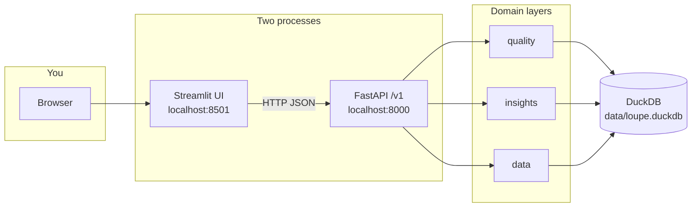

The UI never runs SQL, never scores a finding, and never aggregates bars. Widgets call
HTTP. That boundary is load-bearing: it is how the pages stay testable, and how a second
client (curl, a notebook) gets the same answers.

---

## 2. Starting the app

Two commands, two processes on purpose:

```bash
uv run uvicorn loupe.api.app:create_app --factory   # http://127.0.0.1:8000/v1
uv run streamlit run src/loupe/ui/app.py            # http://localhost:8501
```

On first start the API **bootstraps** the store:

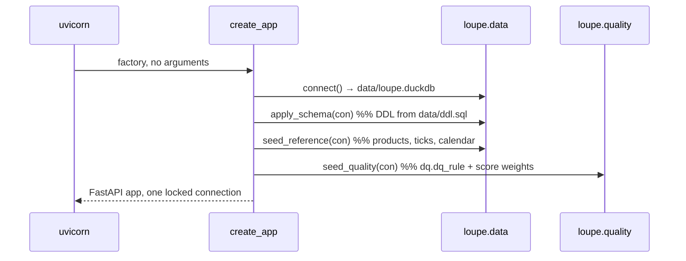

| Function | Package | What it does |
|---|---|---|
| `connect` | `data.connection` | Opens DuckDB (`LOUPE_DB` overrides), loads `icu`, sets `TimeZone = UTC` |
| `apply_schema` | `data.schema` | Runs `src/loupe/data/ddl.sql` — four schemas, idempotent |
| `seed_reference` | `data.reference` | Products, ticks, session calendar from measured profiles |
| `seed_quality` | `quality.seed` | Writes the rule catalogue into `dq.dq_rule` and weights into `dq.score_weight` |

The UI reads `LOUPE_API_URL` (default `http://127.0.0.1:8000/v1`) through
`LoupeClient`. Importing `loupe.api` from Streamlit is forbidden: that would fuse the
layers and make the thin-client boundary untestable.

**One connection, serialised.** FastAPI holds a single DuckDB connection and a lock
(`api.deps.Database`). Quality runs materialise temp tables (`dq_scope_records`); two
concurrent requests on one connection would drop them from under each other. That is the
single-user assumption made concrete, not a performance shortcut.

---

## 3. The store: four schemas

Think of the database as a pipeline that never overwrites the source.

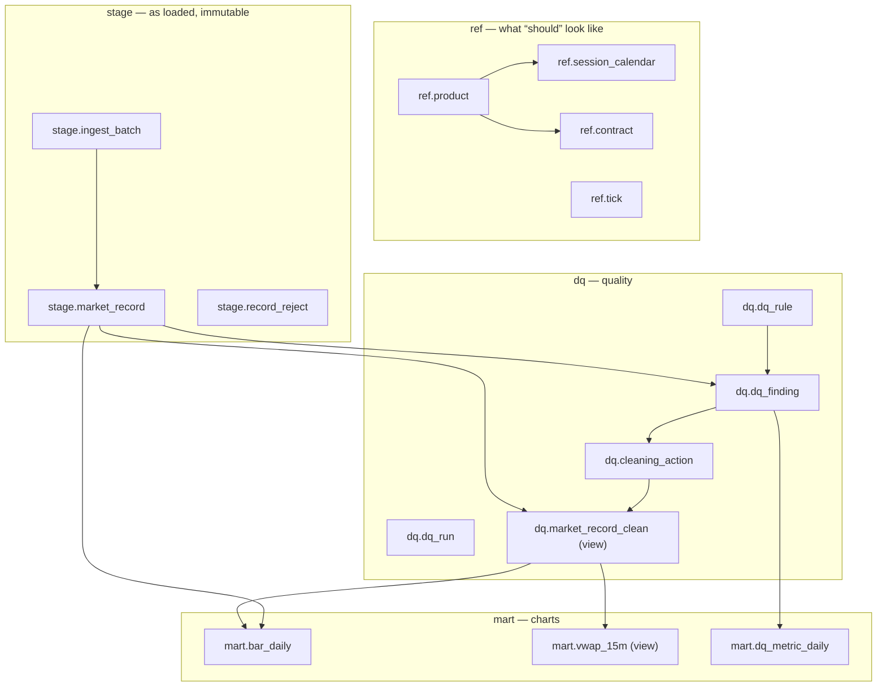

| Schema | Role | Never |
|---|---|---|
| `ref` | Session windows, tick size, product roots | Guessed per request |
| `stage` | Files and rows as ingested | Updated in place |
| `dq` | Rules, runs, findings, cleaning log | Charts |
| `mart` | Daily bars, VWAP view, daily DQ metrics | Source of truth for raw prices |

**Raw is append-only.** A bad close stays on `stage.market_record`. Default cleaning writes
a row in `dq.cleaning_action`; `dq.market_record_clean` is a view that hides excluded /
deduped records. Ask for `basis=raw` or `basis=clean` and you get two reproducible series
from the same file plus the same ruleset.

A **day** is a trading session, attributed to the date it *closes*, not `date(timestamp)`.
For CME-family roots the session rolls at 17:00 America/Chicago. That assignment happens
at ingest (`data.load` + `data.sessions.roll_sql`) and is stored on every row as
`trade_date`. Every later query groups on that column.

---

## 4. The whole journey, one picture

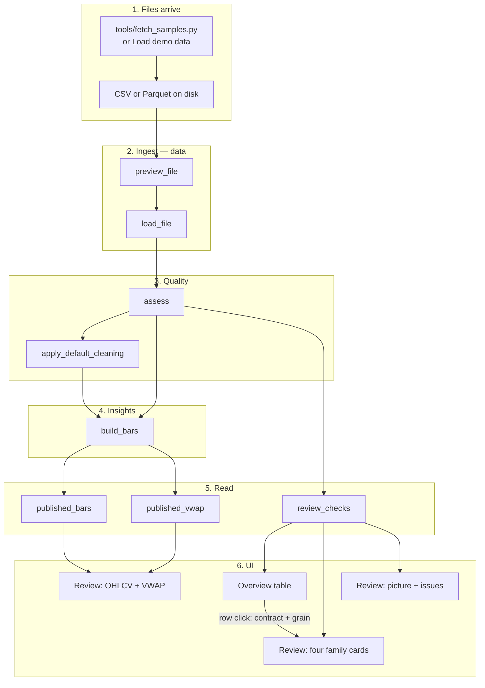

Demo load and a one-file API upload take slightly different quality paths (see §5.3).
Both end in the same tables. Overview and Review both read `GET /v1/dq/checks`; Review
also reads bars and VWAP.

---

## 5. Ingestion

Uploads are the **only** way records enter the store. Nothing fetches Hugging Face *during*
ingest. Fetch is a separate, consented step (`loupe.demo.fetch` / `tools/fetch_samples.py`).

Accepted formats: **CSV or Parquet**. Grain (`minute` or `daily`) is never a reason to
refuse. Capability follows from what you supplied.

| What you loaded | Daily OHLCV | 15-minute VWAP | Reconciliation (`REC.*`) |
|---|---|---|---|
| Minute only | Derived from the tape | Yes | No |
| Daily only | As supplied | Refused in place (“needs minute bars”) | No |
| Both | Derived **and** compared | Yes | Yes |

One grain scores what a file says about itself. Two grains score whether it is true.

### 5.1 Preview — decide before you write

`preview_file` (`data.preview`) inspects a path and returns a `Preview`. Nothing is
committed.

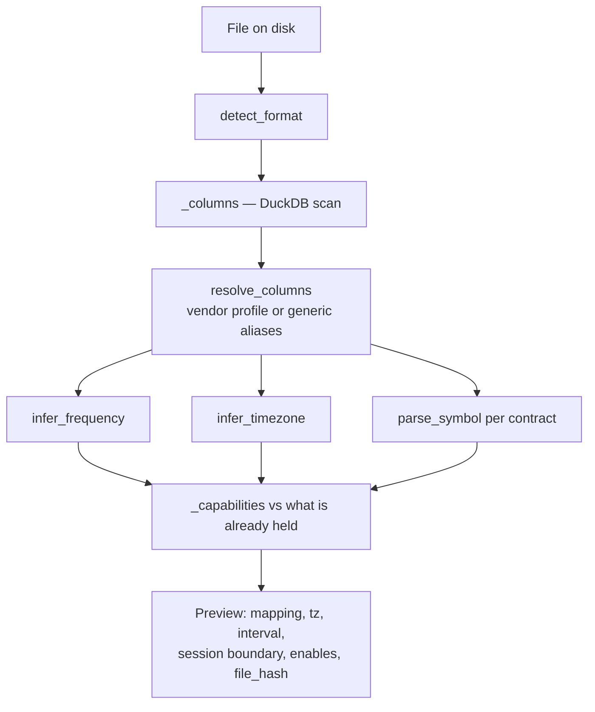

| Function | Job |
|---|---|
| `detect_format` | `.csv` / `.parquet` only; else `UnsupportedFileFormat` |
| `resolve_columns` | Hugging Face sample profile, or name aliases (`contract_symbol` → `contract_id`) |
| `infer_frequency` | Modal timestamp delta; profiles can override |
| `infer_timezone` | Profile + dead-zone histogram; default America/Chicago |
| `_capabilities` | What this file unlocks *given what is already in the store* |
| `file_hash` | SHA-256 of bytes — ingest is idempotent on this |

Decisions that later reprocessing must reproduce are stored on `stage.ingest_batch`:
frequency, timezone, timestamp convention, session boundary, column mapping.

The v1 UI does **not** host a preview panel. `POST /v1/ingest/preview` stays for API
callers. After load, Review discloses gaps in place (VWAP panel stays and says why).
Overview does not draw a score to name a missing grain either.

### 5.2 Load — write immutable rows

`load_file` (`data.load`) takes the preview (or runs it), then:

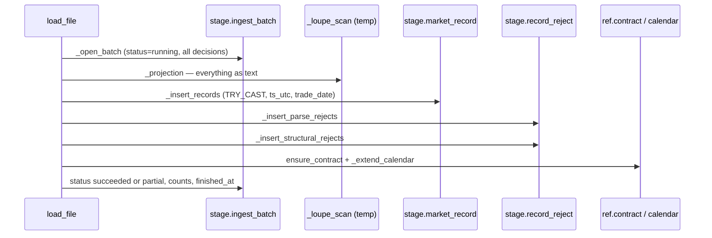

**Parse failures go to `record_reject`. Nulls and soft defects load and become findings.**
If the loader dropped null prices, “detect missing values” would be impossible.

Timestamps: exchange-local wall clock is the source of truth; `ts_utc` is derived with
`AT TIME ZONE` at ingest. Trade date uses `roll_sql` for minute files (roll at session
open); daily rows already *are* a session date, so they are `CAST(ts_exchange AS DATE)`.

A second upload of the same bytes raises `DuplicateFileError`. The API turns that into
**409 with the existing batch**, not a silent extra copy.

### 5.3 What happens after load

Two callers, two quality strategies:

**A. API default** (`POST /v1/ingest/batches?validate=true`, the default):

```
preview_file → load_file → assess(batch_id=…) → build_bars(those contracts)
```

`assess` is scoped to **that batch**. Reconciliation cannot fire yet: the run has not seen
the other grain. A second file for the same contract still needs `POST /v1/dq/runs`
(unscoped) before `REC.*` is in scope.

**B. Load demo data** (the UI path):

```
prepare_demo_corpus → POST /ingest/batches × N (validate=false, origin=demo)
                   → POST /dq/runs            (corpus-wide)
```

Per-file validation would run the catalogue ~48 times on one batch each, then again on
everything. Demo skips it and does one corpus-wide run so both grains are visible to
`REC.*`.

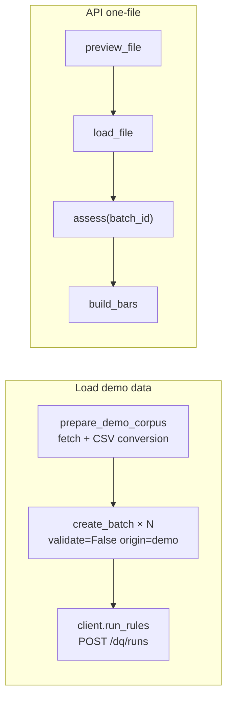

`build_bars` always runs after a successful batch (even when `validate=false`) so charts
are not empty for a file that just loaded.

`origin` is a label (`upload` / `demo` / `injected`), not a different parser. It exists so
planted defects can never be drawn as vendor ones. `GET /v1/health` reports
`synthetic_batches` / `synthetic_records`; the UI reads health before anything else.

---

## 6. Quality: rules, findings, cleaning, score

Rules are **rows**, not `if rule_id == …` branches in the scorer. `seed_quality` writes
`dq.dq_rule`. Runners read thresholds from that row. Changing a default is a catalogue
edit plus a re-seed.

### 6.1 `assess` — the pass the API calls

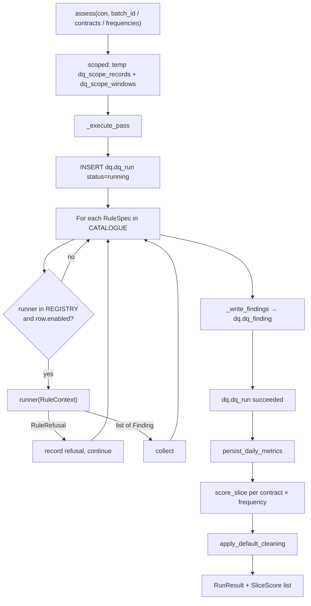

| Function | Module | Role |
|---|---|---|
| `scoped` | `quality.runner` | One scoped record set + shared coverage/roll windows for every rule |
| `resolve_windows` | `quality.windows` | Liquidity window from `CMP.SESSION_MISSING` params |
| `resolve_roll_windows` | `quality.windows` | Near-expiry suppression from `ROL.THIN_NEAR_EXPIRY` params |
| `REGISTRY` / `@rule` | `quality.registry` | Maps `CMP.NULL_FIELD` → function in `quality.rules.*` |
| `persist_daily_metrics` | `quality.scoring` | Writes `mart.dq_metric_daily` set-based |
| `score_slice` | `quality.scoring` | Weighted mean over **dimensions in scope** |
| `apply_default_cleaning` | `quality.cleaning` | Writes `dq.cleaning_action` |

Importing `quality.rules` **is** registration: each module’s `@rule("…")` decorator fills
`REGISTRY`. A catalogue row with no runner is caught by a parity test.

A runner that lacks an input it needs raises `RuleRefusal` (for example completeness
without a calendar). That is distinct from “evaluated and found nothing”: reporting a
normal session as missing is worse than reporting nothing.

### 6.2 Rule families (what the engine actually runs)

Prefix is the dimension. ~38 rules are seeded. The reviewer strip only *labels* a subset.
Cards, overlay, picture and issues are then filtered to the **Quality grain** (`minute` or
`daily`) the page asked for — so a daily Invalid finding cannot paint a minute-derived
candle.

| Prefix | Dimension | Examples | On the four cards? |
|---|---|---|---|
| `CMP.*` | Completeness | missing timestamps, absent session, null field | Gaps (except `NULL_FIELD` → Invalid) |
| `UNQ.*` | Uniqueness | exact dup, key conflict | Duplicates (`DUPLICATE_FILE` is ingest 409, no finding) |
| `VAL.*` | Validity | negative volume, off-tick | Invalid values |
| `CON.*` | Consistency | high &lt; low, close outside range | Some on Invalid |
| `TIM.*` | Timeliness | timezone misaligned, off-grid | Off the strip |
| `REC.*` | Reconciliation | OHLC disagree, volume shortfall | Off the strip |
| `ROL.*` | Roll | thin near expiry | Off the strip |
| `OUT.*` | Outliers (optional) | MAD on returns | Off the strip |

**Reconciliation** is the only family that can catch a daily file that is internally
perfect and still wrong. It compares vendor daily bars to bars derived from the minute
tape, and only when **both** grains exist for that contract.

### 6.3 Default cleaning (automatic, not a button)

v1 is **report-only for the user**: no apply, no override in the UI. The engine still
cleans.

| Policy | Action |
|---|---|
| Finding severity `error` or `critical` | `exclude` that record from the clean view |
| `UNQ.EXACT_DUPLICATE` | `dedupe_drop` — keep the lowest `source_row` |
| `VAL.OFF_TICK_PRICE` | Flag only — never exclude (often a tick-reference issue) |

`what_we_did` on the page is this changelog, aggregated by rule × trade date × action
(`quality.changelog.changelog`). The client does not re-derive it.

### 6.4 Score (on the wire; neither page draws it)

Per-dimension 0–100; overall = weighted mean over dimensions **in scope**. Default weights:
completeness 0.30, validity 0.25, consistency 0.20, uniqueness 0.15, timeliness 0.10,
reconciliation **0.20 when both grains exist**. Denominator is 1.20 or 1.00 after
renormalising. Every score carries `scope_signature` so you do not rank a five-dimension
score against a six-dimension one.

The number still travels on `GET /v1/dq/checks` and `GET /v1/dq/summary`. Review does
**not** print it (no score caption, no `scope_signature` line). Daily-only VWAP already
says “needs minute bars”; that is the missing-grain copy. When some other surface *does*
show a score, `specs/dq-rules-and-scoring.md` §11.3 still applies.

### 6.5 Patterns and suggestions

| Function | Route | What it is |
|---|---|---|
| `find_patterns` | `GET /v1/insights/patterns` | Lift: share of findings in a bucket vs share of records. A ratio, not a count. |
| `suggest` | `GET /v1/insights/suggestions` | Proposed catalogue/calendar changes with rationale and expected effect. Text only. |

Apply / dismiss are **extensions** (absent routes, not 405). Recurring-patterns **card
count** is standing patterns, not finding count. `review_checks` calls `find_patterns`
with the same `frequency` as the findings, so the UI does not group `findings[]` itself
and a Minute row is not mixed with Daily concentrations.

---

## 7. Insights: bars, VWAP, publish gate

`insights` owns aggregation and “may we publish this session?”. It does not own rule
definitions.

### 7.1 Daily bars

`build_bars` materialises `mart.bar_daily` for every pair of:

- **basis** `raw` | `clean` — whether cleaning was applied
- **source** `derived` | `vendor` — minute tape aggregated vs supplied daily file

| Field | Rule |
|---|---|
| Open / close | Value of the **first / last** record by `ts_utc` (tie-break `source_row`) — not `min(open)` |
| High / low | `max(high)` / `min(low)` |
| Volume | `sum(volume)` |

A session with **no records produces no row**. Absence is a dashed mark from the overlay,
never a zero-filled candle.

Vendor close is a **settlement**; derived close is **last trade**. They are not the same
number and must not be tuned to match.

### 7.2 Rolling 15-minute VWAP

`vwap_15m` / `published_vwap`:

- Price: typical `(H+L+C)/3` by default
- Window: `RANGE BETWEEN INTERVAL 15 MINUTES PRECEDING AND CURRENT ROW` (time, not 15 *rows*)
- Partition: `(contract_id, trade_date)` — never across the maintenance break
- Zero window volume → `NULL` (chart breaks the line)
- First 15 minutes of the session flagged `is_warmup`

Daily-only contracts: `capability_gap` → `CAP.FREQUENCY_UNAVAILABLE`. No fake 15-*day*
VWAP. VWAP is **always minute tape**. On Review, if Quality grain is Daily but the
contract also holds minute records, the line still draws, labelled **Minute tape ·
context only for Daily quality grain**, with selected-family VWAP marks suppressed.

### 7.3 Publish gate

`insights.gate`: a `critical` open finding **blocks** that session’s published series.
Blocked sessions are named, not silently dropped. File-scope findings (e.g.
`TIM.TIMEZONE_MISALIGNED`) still raise `max_severity` on bars even when they are not
counted on every session (counting them would shift a whole trend by a constant).

`published_bars` and `published_vwap` apply this gate. Handlers do not re-decide it.

---

## 8. API architecture

Base path `/v1`. FastAPI routers under `src/loupe/api/routes/`. Handlers **shape JSON**;
they do not re-derive scores or bars.

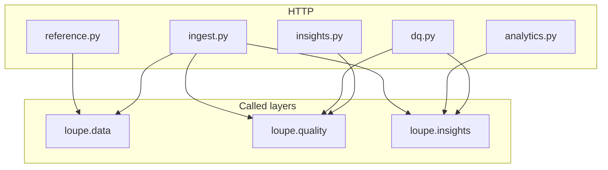

Conventions: UTC on the wire; dates are **trade dates**; `basis=raw|clean`;
`frequency=minute|daily` (grain *read from*, not grain returned); errors are RFC 7807
with `STR.*` (structurally unacceptable) or `CAP.*` (data cannot support the request).

Writes are **synchronous**: 201 with a finished batch, not 202 + a job id. Streamlit has
no server push; at sample scale a job table buys nothing.

### 8.1 Reference — `api/routes/reference.py`

| Method | Path | Calls | For |
|---|---|---|---|
| GET | `/health` | SQL on information_schema + counts | Liveness, schema/rules seeded, synthetic disclosure |
| GET | `/contracts` | `ref.contract` + coverage from `stage.market_record` | Review picker, Quality grain options, Overview rows, ingested-file coverage buckets |
| GET | `/contracts/{id}` | same, one row | Detail |
| GET | `/calendar` | `ref.session_calendar` | Expected slots / holidays (API; UI does not call it) |

### 8.2 Ingest — `api/routes/ingest.py`

| Method | Path | Calls | For |
|---|---|---|---|
| POST | `/ingest/preview` | `preview_file` | Dry run; capability matrix |
| POST | `/ingest/batches` | `preview_file` → `load_file` → optional `assess` → `build_bars` | Commit a file; 201 or 409 duplicate |
| GET | `/ingest/batches` | SQL + `_summary` | Sidebar inventory (not a directory walk) |
| GET | `/ingest/batches/{id}` | `_summary` | One batch |
| GET | `/ingest/batches/{id}/rejects` | `stage.record_reject` | Parse failures |
| DELETE | `/ingest/batches/{id}` | `purge_batch` | Soft-delete batch; cascade records, some findings, mart rows |

Purge does **not** delete session-level findings from a corpus-wide run that might still
describe another batch’s records. Re-validate (`POST /dq/runs`) after a purge.

### 8.3 Analytics — `api/routes/analytics.py`

| Method | Path | Calls | For |
|---|---|---|---|
| GET | `/analytics/bars/daily` | `published_bars`, `read_bars` (vendor, for reconcilation fields) | Daily OHLCV + quality columns |
| GET | `/analytics/vwap` | `published_vwap` | Rolling 15-minute line; 422 if no minute grain |
| GET | `/analytics/compare` | `compare_bars` / `compare_vwap` or dual `read_bars` | `compare=basis` (raw vs clean) or `compare=frequency` (supplied vs derived) |

`frequency` on bars: `minute` means *aggregate the tape*; `daily` means *return supplied
settlement bars*. Both return daily bars. They are not the same numbers.

### 8.4 Data quality — `api/routes/dq.py`

| Method | Path | Calls | For |
|---|---|---|---|
| GET | `/dq/summary` | `scoped`, `score_slice`, `contract_rows`, `worst_field` | Book-level score envelope (UI does not use this) |
| GET | `/dq/checks` | `review_checks` | **Review + Overview envelope** (cards, overlay, picture, selected-family issues) |
| GET | `/dq/metrics` | `mart.dq_metric_daily` or findings grouped by rule | Trends |
| GET | `/dq/findings` | SQL + `corroborate` | Paginated findings + tape qualification of daily claims |
| GET | `/dq/findings/{id}` | same | One finding |
| GET | `/dq/changelog` | `changelog` | Cleaning decisions, aggregated |
| GET | `/dq/rules` | `dq.dq_rule` | Catalogue as seeded |
| POST | `/dq/runs` | `assess` → `build_bars` | Corpus-wide (or scoped) re-validate |
| GET | `/dq/runs/{id}` | `dq.dq_run` | Past run, not a poll handle |

Absent in v1 (on purpose, not 405): `POST /dq/findings/{id}/review`, `POST/PATCH /dq/rules`.

`GET /dq/checks` is the important one. Cards, overlay booleans, picture payload, and
**selected-family** issues are composed in `quality.review.review_checks`. A widget that
grouped `GET /dq/findings` would be doing the quality layer’s job.

`frequency` is `minute` or `daily`. API callers may omit it (finest grain held). Review
and Overview **always pass it**. Asking for a grain the contract does not hold is **422
`CAP.FREQUENCY_UNAVAILABLE`**, not an empty card strip. Findings and patterns are
filtered to that grain before cards, issues, overlay and picture are built. Overlay
presence uses `mart.bar_daily.source` (`derived` at minute, `vendor` at daily) so a
vendor-only invalid bar cannot mark a minute-derived candle.

`review_checks` itself calls `latest_run`, grain-filtered findings SQL, `find_patterns`,
changelog actions, `score_slice`, and overlay/picture helpers (Invalid pictures carry
`evidence_frequency` / `evidence_source`; pattern pictures are one `(rule_id, dimension)`
group with findings vs record-exposure shares).

### 8.5 Insights reports — `api/routes/insights.py`

| Method | Path | Calls | For |
|---|---|---|---|
| GET | `/insights/patterns` | `quality.patterns.find_patterns` | Lift table |
| GET | `/insights/suggestions` | `quality.suggestions.suggest` | Report-only proposals |

Apply / dismiss are extensions and are **not registered**.

---

## 9. What feeds the UI

Two destinations in one Streamlit script (`ui/app.py`). Sidebar switch: **Overview | Review**,
default **Overview** (`ui/chrome.render_destination`). Shared on both: demo ingest
(`ui/demo.py`). Charts in `ui/charts.py` (Altair). HTTP only via `LoupeClient`.

Review reuses the selected row from `GET /contracts` for its header; it makes no detail
request. The caption shows contract month, exchange, the resolved grain's full **observed**
coverage, and Quality grain. From / To is appended separately as the Review window, so a
filtered chart never makes its selected dates look like listing or expiry dates.

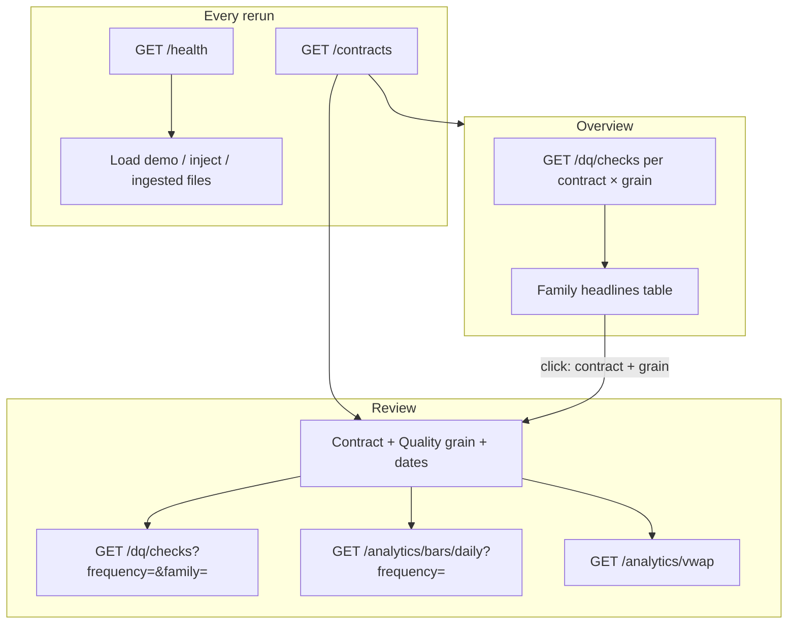

### 9.1 Overview

Corpus scan so a reviewer can pick a noisy contract before opening Review. **No** contract
picker, Quality grain control, or date filters. A Grain segmented control (All / Daily /
Minute) is a *view* filter, not Quality grain.

| UI function | Client method | Endpoint |
|---|---|---|
| `cached_rows` | `contracts` then `checks(contract, family=gaps, frequency=)` | `GET /contracts`, then `GET /dq/checks` once per held grain |
| `render_overview` | — | `st.dataframe`; row click queues Review |

A dual-grain contract appears **twice** (Minute then Daily). Cells are `count unit` only;
detail stays on Review. Cache key is store fingerprint (`records` / `batches` /
`synthetic_batches` / contract ids) so a family click on Review does not re-hit 40×
checks. `checked: false` says the check has not run — zeros are not painted as clean.

Click-through (`overview_open` → `apply_pending_open`) opens Review with that `contract`
and `quality_grain`. Family stays whatever Review last had (default `gaps`).

### 9.2 Review

Main-column order is load-bearing: **cards, Daily OHLCV, VWAP, picture, issues**. No
score line. The four cards *are* the family selector (button on each card; no Check row).

**Quality grain** (sidebar): dual-grain contracts get Minute | Daily (default Minute).
Single-grain contracts show the held grain as a caption. Header and OHLCV subtitle name
the resolved grain. Minute reads **derived** daily bars; Daily reads **supplied** vendor
daily bars. Changing family never changes grain.

| UI function | Client method | Endpoint | Domain function |
|---|---|---|---|
| `read_health` | `health` | `GET /health` | SQL counts |
| `contract_catalogue` | `contracts` | `GET /contracts` | picker + held grains |
| `render_demo` / list | `batches` (+ contracts for coverage) | `GET /ingest/batches` | `_summary`; grouped Daily + minute / Daily-only / Minute-only |
| Load demo | `create_batch` | `POST /ingest/batches` | `load_file` (+ `build_bars`; no `assess`) |
| After demo files | `run_rules` | `POST /dq/runs` | `assess` + `build_bars` |
| Inject / remove | `create_batch` / `purge_batch` | POST / DELETE ingest | then `run_rules` |
| `load_checks` | `checks` | `GET /dq/checks` | `review_checks` (grain + family) |
| `load_bars` | `bars_daily` | `GET /analytics/bars/daily` | `published_bars` (same grain) |
| `load_vwap` | `vwap` | `GET /analytics/vwap` | `published_vwap` (always minute) |

Family lives in `st.session_state["family"]`. Changing it re-runs the script and hits
`/dq/checks?family=` again; zoom is preserved (chart identity does not include family).
Changing contract, grain, or From / To **resets** zoom via `charts.chart_scope_key`.
OHLCV and volume share one x (trade date); VWAP has its own (intraday timestamps).

Overlay marks come from the checks envelope. Charts do **not** paint `max_severity`; they
join bars by `trade_date`. An absent settlement is a dashed column with an on-chart
**absent** label — never a zero bar. Hover shows date, OHLC, and selected-family
**status**.

A `CAP.FREQUENCY_UNAVAILABLE` on VWAP is **panel content**, not an empty chart. Issues
heading is **Issues in selected family** — the table matches the card, not every family
at once.

### 9.3 Demo chrome (both destinations)

Ingested files group by **contract coverage**, not the file’s own frequency. Both files of
a dual-grain contract sit under **Daily + minute**. CSV with `origin=demo` is marked
converted from Parquet (format fact, not a defect).

Planted defects (`origin=injected`) group by the same catalogue map as the cards
(`strip_family`). Recurring patterns is not a planted family. Off-strip injectables land
in **Other (off the strip)**. The sidebar warning lists planted **filenames** under those
families; it does not say “findings below were planted.”

### 9.4 Routes the UI does not call

They still exist for notebooks, OpenAPI, and a future chrome:

- `/ingest/preview`, `/analytics/compare`
- `/dq/summary`, `/dq/metrics`, `/dq/findings`, `/dq/changelog`, `/dq/rules`
- `/insights/patterns`, `/insights/suggestions` (`LoupeClient.suggestions` exists; neither
  page renders a suggestions table — What we did is the changelog)
- `/calendar`

---

## 10. How the pieces fit

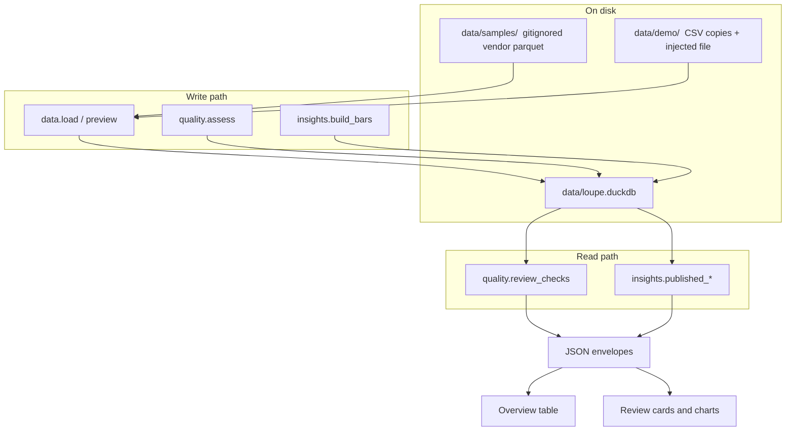

Mental model:

1. **Files** become immutable `stage.market_record` rows, with UTC and trade date decided
   once.
2. **Rules** look at those rows (and the calendar) and write findings + cleaning actions.
3. **Marts** turn clean/raw records into daily bars; VWAP is a SQL window over minute rows.
4. **HTTP** is a typed facade. One connection, finished results.
5. **Overview** projects every contract × grain onto four family headlines.
6. **Review** projects one contract × one grain: picker in, three GETs, charts out.
   Cards, bars, overlay and issues all use that grain.

If a number looks wrong, ask: was it assigned at ingest (timezone / trade date), at the
rule (finding), at cleaning (excluded from clean), at the bar (positional open/close), at
the **Quality grain** (minute-derived vs vendor daily), or at the gate (session withheld)?
Those are different layers.

---

## 11. What you can extend without rewriting

Designed as data or a new function behind an existing seam.

| Change | Where | Cost |
|---|---|---|
| New CSV/Parquet layout | `data.profiles` vendor profile + column mapping | Preview/load; no API change |
| New product root / session | `data.profiles` + `seed_reference` | Calendar, tick, expected grid |
| New DQ rule | Spec §17 workflow: spec → `RuleSpec` in `catalogue.py` → `@rule` runner → fixture → seed | Parity test fails if any step is skipped |
| New pattern / suggestion generator | `quality.patterns` / `suggestions` | GET envelopes already exist |
| Suggestion apply / finding override | New POST routes (named extensions) | Mutate catalogue/calendar, re-run in the same request |
| RBAC | FastAPI dependency; filter `contract` | **No path changes** — API is resource-shaped |
| Async ingest | Job table + 202 when a load exceeds ~30s | Streamlit would need polling; size cap until then |
| AI narrative | Over **aggregated pattern stats only** | Raw ticks never leave the process |
| Bulk `/dq/checks` | Only if Overview’s per-row loop is too slow for demo | Measure first; the cache is the current answer |
| Book-grain inventory strip | UI spec names it an extension | Do not fold it into Overview’s table |

### Hard boundaries (v1 non-goals)

- Live feeds, multi-user writers, auth as a product
- Runtime Hugging Face fetches during ingest
- Continuous / back-adjusted series as a product feature (`roll_date` exists for later)
- Interactive apply / override from the UI
- SQL, scores, or bar math inside Streamlit callbacks
- Inventing a 15-day VWAP so a daily-only contract “has a line”
- Persona views (Risk / Trader / Analyst) — Overview is a corpus scan, not a role

---

## 12. Trade-offs (what you pay for the choices)

Every locked decision has a cost. The interesting ones:

| Choice | Why | What you give up |
|---|---|---|
| **Two processes, HTTP between UI and API** | Real layer boundary; UI tests stub `LoupeClient`; OpenAPI is evidence | Two commands; 120s client timeout because ingest is sync |
| **Streamlit** | Fast reviewer UI; `st.status` around demo load | Full script rerun on every click; no push; family change = another `/dq/checks` |
| **Two destinations, Overview first** | Scan 40 contracts without stuffing a table above Review’s charts | Overview loops `GET /dq/checks` per grain; cache + fingerprint, not a new route |
| **Explicit Quality grain** | Cards, bars and overlay judge the same tape | Dual-grain contracts need a control; family-dependent auto-source was rejected because cards would jump |
| **VWAP always minute** | A 15-minute window cannot be faked from daily bars | Daily quality grain still shows the line as context-only, or “needs minute bars” |
| **FastAPI + Pydantic** | Typed contract, RFC 7807, `TestClient` | Handlers must stay thin or they become a second scorer |
| **DuckDB, one file** | SQL is inspectable; persist and query are one engine | Single writer; lock around every request; not a warehouse |
| **DuckDB vs Polars** | Analytics stay reviewable SQL; single-user is *why* one writer is OK | Less of a dataframe pipeline culture |
| **Synchronous ingest and DQ runs** | Honest completion; no job table at sample scale | A naïve per-row insert once took **240s**; set-based writes keep corpus-wide runs ~10s. Reintroducing a Python loop will blow the ~30s budget here first |
| **Immutable raw + cleaning log** | Replayable; raw vs clean compare is free | Storage duplication; “edit the cell” is not a feature |
| **Exchange-local clock, UTC derived at ingest** | Session logic in local time | A wrong timezone at preview poisons `trade_date` for the whole batch |
| **Accept daily and minute** | Settlement defects live in daily; recon needs both | Capability matrix, `CAP.*` refusals, score `scope_signature` |
| **Batch-scoped `assess` on API upload** | Fast feedback on the file you just sent | `REC.*` silent until `POST /dq/runs`; demo already does the corpus-wide run |
| **Rules as rows** | Tune severity/params without redeploying runners | A disabled row looks like “the rule found nothing” unless you check the catalogue |
| **Report-only UI** | Exercise asks to identify and suggest, not mutate | Suggestions can rot relative to the live catalogue |
| **No preview panel in the UI** | Demo is the ingest path; less chrome | API-only callers still preview; reviewers learn capability *after* load |
| **No score on Review** | Four cards are the trust answer | `scope_signature` stays on the wire; mixed-scope ranking is an API caller’s problem |
| **Publish gate in `insights`, not `quality`** | Quality must not know about charts | Two modules must agree on which findings touch a session (`gate.session_quality_sql`) |
| **Purge leaves some corpus-wide findings** | A session finding may describe two batches | After DELETE you should re-run rules; the API says so rather than guessing |

---

## 13. A compact call graph (ingest → screen)

Useful when debugging “why is this card empty / why is VWAP refused / why is recon missing /
why does Overview disagree with Review”.

```
Streamlit  ui/app.py:main
  LoupeClient.health                    → GET  /health
  LoupeClient.contracts                 → GET  /contracts
  render_destination                    → Overview | Review (default Overview)
  LoupeClient.batches                   → GET  /ingest/batches
  LoupeClient.create_batch              → POST /ingest/batches
        preview_file
        load_file
          _open_batch
          _insert_records / _insert_*_rejects
          ensure_contract, _extend_calendar
        assess                          (if validate=true)
          scoped → run_rules body → persist_daily_metrics → score_slice
          apply_default_cleaning
        build_bars
  LoupeClient.run_rules                 → POST /dq/runs     (demo, after all files)
        assess (unscoped) → build_bars

  Overview  ui/overview.cached_rows
    LoupeClient.checks × (contract, frequency)
                                → GET  /dq/checks?family=gaps&frequency=
        review_checks (full held window, no dates)
    render_overview             → table; row click → Review

  Review    ui/review.render_review
    LoupeClient.checks          → GET  /dq/checks?frequency=&family=
        review_checks
          latest_run, grain-filtered findings, find_patterns(frequency=)
          changelog, score_slice, overlay + picture, selected-family issues
    LoupeClient.bars_daily      → GET  /analytics/bars/daily?frequency=
        published_bars → mart.bar_daily source derived|vendor + gate
    LoupeClient.vwap            → GET  /analytics/vwap
        published_vwap → vwap_15m + capability_gap + gate
    ui/charts                   (no SQL; scope-keyed zoom)
```

---

## 14. Where the code lives

```
src/loupe/
  data/         connect, DDL, preview, load, purge, reference, sessions
  quality/      catalogue, runner, rules/*, scoring, cleaning, review, patterns, suggestions
  insights/     bars, vwap, compare, gate
  api/          app factory, deps (lock), routes/*, Pydantic models, RFC 7807
  ui/           app.py, client.py, chrome, demo, overview, review, charts
  demo/         fetch, corpus prepare, labelled injection
```

Tests follow the same seams: unit fixtures for rules, `TestClient` for HTTP shapes,
`AppTest` with a stub client for page assembly (including Overview click-through), and
`tests/integration/` with a real uvicorn port and a file-backed DuckDB — the only tier
that stubs neither side. The map is `docs/how-tests-work.md`.
