# How Loupe tests work

A primer for `tests/`: what each folder is for, what is real vs fake, and how
one test runs from a CSV to a pass or fail.

Start with the pictures. The later sections name files.

**This is a map, not the spec.** What a rule must do, what an HTTP body looks
like, and what a page must show live in `specs/`. If this document and a spec
disagree, the spec wins.

| Want the exact… | Read |
|---|---|
| Testing strategy and the “both sides” rule | `specs/loupe-solution-design.md` §13 |
| One-defect fixture naming | `specs/dq-rules-and-scoring.md` §15, `tests/fixtures/README.md` |
| HTTP envelopes the API tests check | `specs/api-contract.md` |
| Oracle claims (vendor minute vs daily) | `specs/sample-corpus.md` §6 |
| Running app, who calls whom | `docs/how-loupe-works.md` |

---

## 1. The whole suite, in one picture

The test folders follow the app layers. Each folder asks **one** question.

```
tests/
  fixtures/       tiny CSV files with one planted defect
  data/           can we load a file into DuckDB?
  quality/        do the checks fire on the planted defect?
  insights/       are daily bars and VWAP the numbers we claimed?
  demo/           does labelled injection stay labelled?
  api/            does HTTP return the agreed JSON?
  ui/             does the page assemble that JSON into the right widgets?
  integration/    does a real server + real file still work together?
```

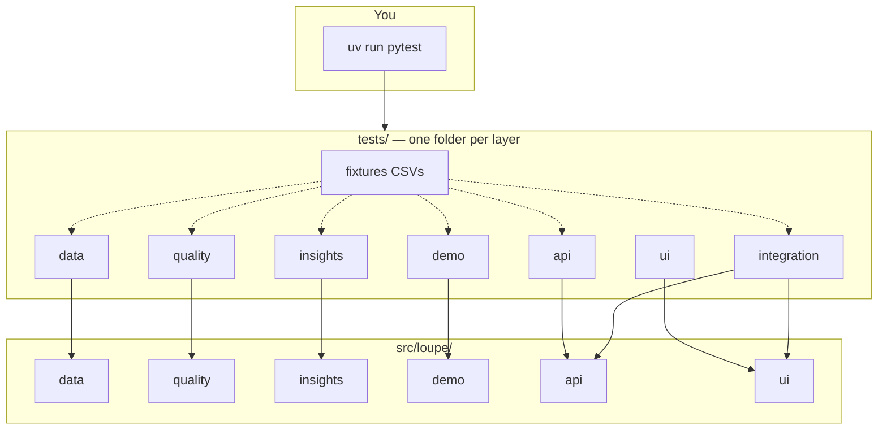

Run everything with:

```bash
uv run pytest
```

That is also what CI and the git hook run. Tests that need the vendor sample
**skip** when the sample is not on disk. You do not need to fetch data to get a
green suite.

---

## 2. Why the folders exist

A test that talks to everything at once is slow and hard to read when it fails.
So most tests pick **one seam** and fake the rest.

The cost: a bug can hide in the join — the place two layers meet that no folder
fully covers.

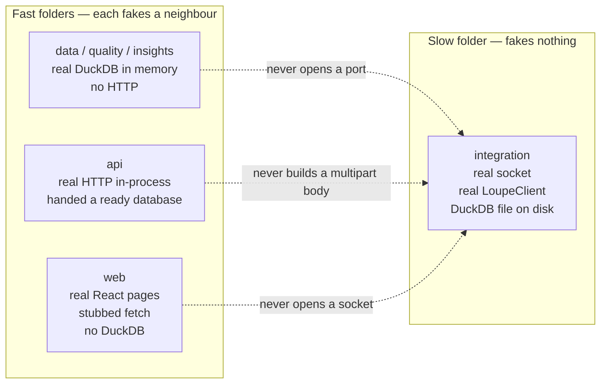

Read it this way:

| Folder | Real | Fake / not there |
|---|---|---|
| `data`, `quality`, `insights`, `demo` | DuckDB + the layer's Python | HTTP, the UI |
| `api` | FastAPI + DuckDB | No TCP socket. `TestClient` talks in-process. Database is already set up. |
| `web` | React components, in jsdom | The API. A stubbed `fetch` returns canned JSON. No DuckDB. |
| `integration` | Server, client, file on disk | Almost nothing. Small on purpose. |

That last row exists because three first-run bugs reached `main` behind a green
suite: empty store, upload that did nothing, bars missing until something else
rebuilt them. Each faster folder was testing the thing the others already
owned. The joins were untested.

---

## 3. What happens when you run pytest

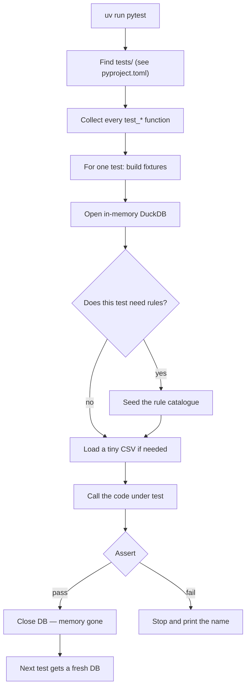

Two details matter:

1. **Almost every test gets a brand-new database.** Nothing leaks from the
   test above it.
2. **SQL is not mocked.** The queries *are* the logic. A fake connection would
   only prove we wrote the SQL we wrote.

The vendor sample is the exception: those tests skip unless `data/samples/` is
present. They are marked `samples`.

---

## 4. Shared setup

`tests/conftest.py` is the common kit. Other folders add their own helpers on
top.

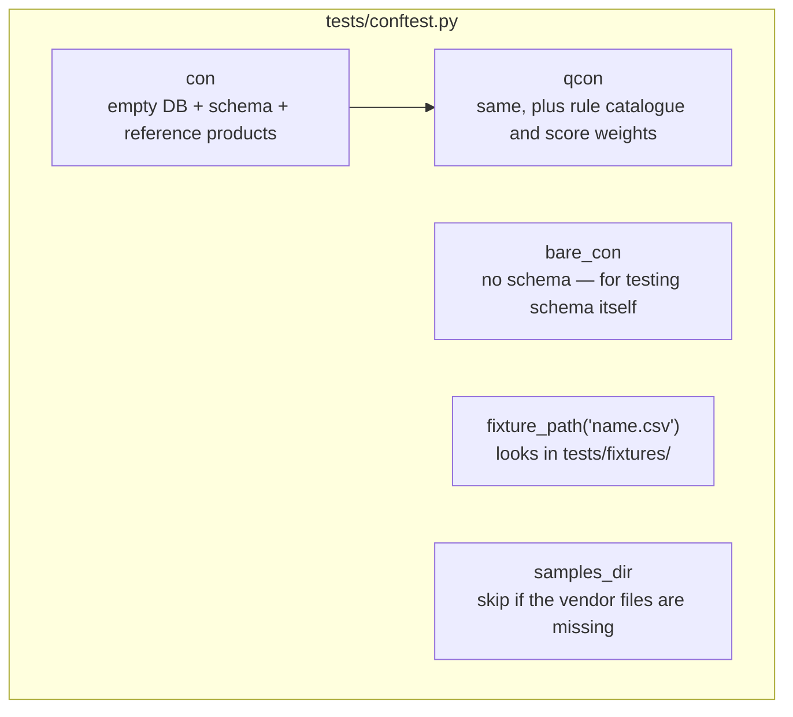

| Fixture | What you get | Who uses it |
|---|---|---|
| `con` | Schema and product/session facts. No rules. | `tests/data/` |
| `qcon` | `con` plus the quality catalogue. | `tests/quality/`, and anyone who must run rules |
| `bare_con` | A blank connection. | Schema tests |
| `fixture_path` | Path to a committed CSV. | Almost everyone |
| `samples_dir` | Path to fetched vendor files, or a skip. | Oracle and a few load tests |

Folder-level extras:

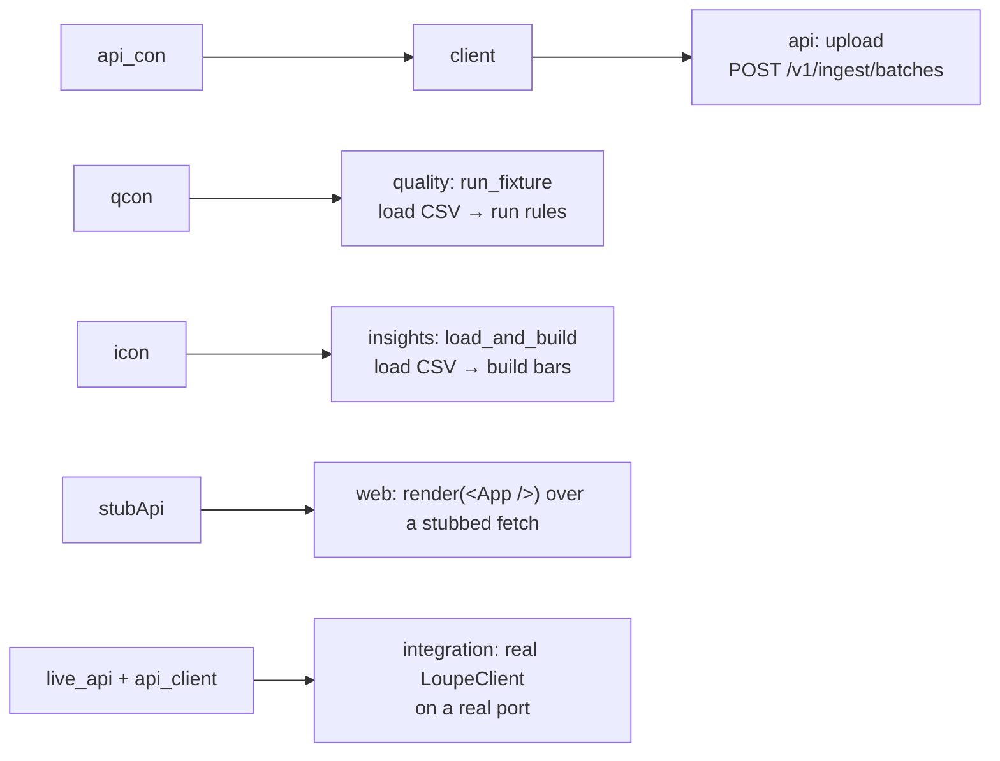

---

## 5. One test, start to finish

Most quality tests look like this. The planted row is in a tiny CSV. The test
loads it the same way the app would, runs the real engine, and checks the
finding table.

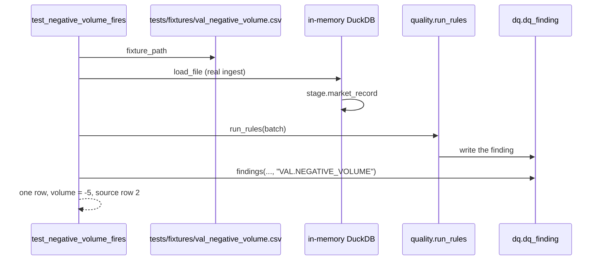

A failing name is the rule that broke: `test_negative_volume_fires` plus
`val_negative_volume.csv`. That is why fixtures are tiny and named after the
rule.

Reconciliation is the same idea with **two** files, because the defect is the
disagreement between minute and daily — not a bad row in either file alone.

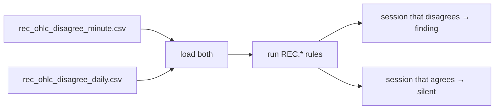

---

## 6. Folder by folder

### `tests/data/` — getting rows in

Question: can we read a file, assign a trade date, and refuse junk?

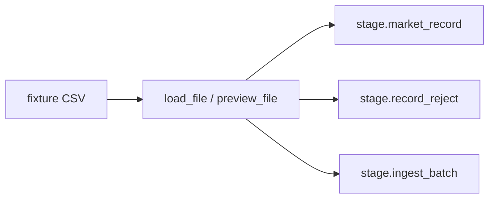

| File | What it checks |
|---|---|
| `test_schema.py` | Tables exist; applying schema twice is safe. |
| `test_load.py` | Accept, reject, duplicate file, trade date, frequency. |
| `test_preview.py` | Look at a file without writing it. |
| `test_symbols.py` | Contract ids such as `ESZ25` and `SR3`. |
| `test_sessions.py` | Session grid (CME 23h, ICE, CBOT grain). |
| `test_reference_seed.py` | Product and calendar facts; some need the sample. |
| `test_purge.py` | Deleting a batch does not delete another batch's findings. |

Uses `con` (no rule catalogue). A null price is loaded, not rejected — so a
later quality test can still see it.

### `tests/quality/` — the checks

Question: does this rule fire on the planted defect, and stay quiet otherwise?

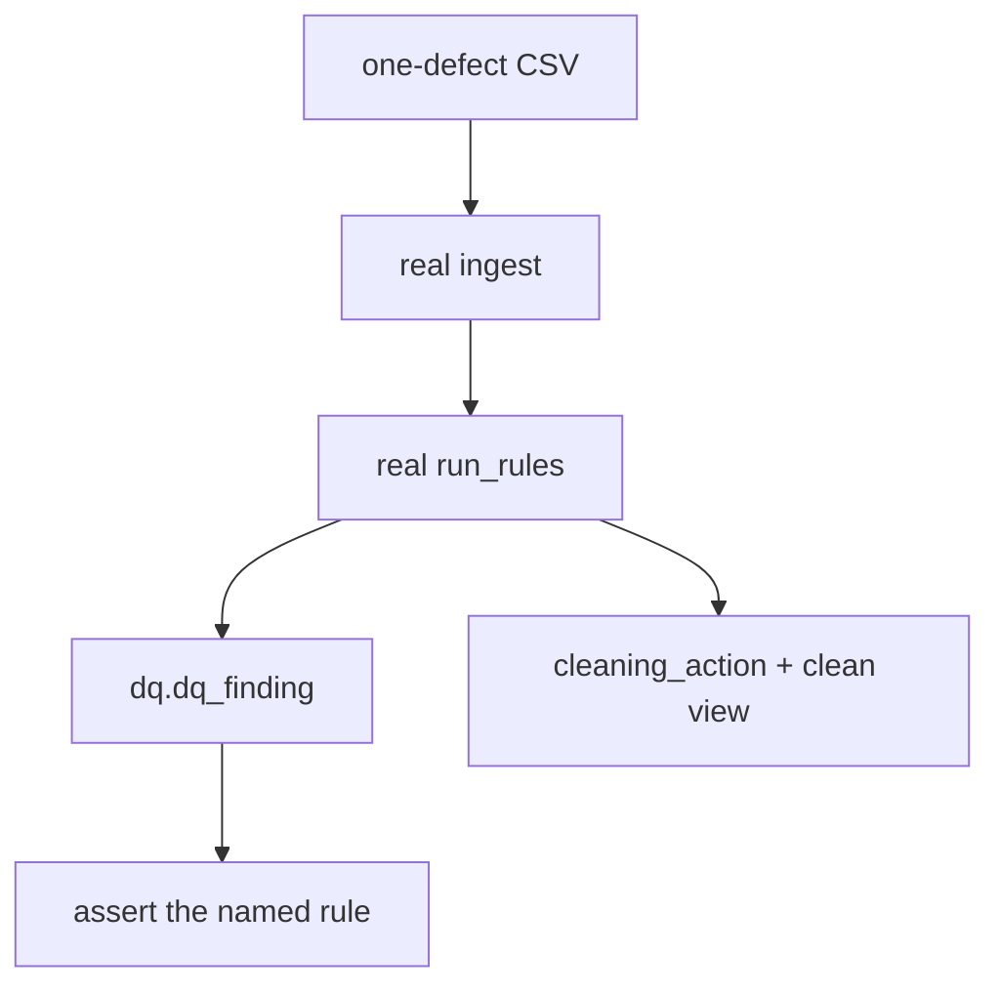

| File | Family / topic |
|---|---|
| `test_catalogue.py` | Seeded rules match the spec list; every rule has a runner. |
| `test_rules_completeness.py` | `CMP.*` gaps and missing sessions |
| `test_rules_validity.py` | `VAL.*` impossible prices and volumes |
| `test_rules_consistency.py` | `CON.*` high &lt; low, close outside range, … |
| `test_rules_uniqueness.py` | `UNQ.*` copies and key conflicts |
| `test_rules_timeliness.py` | `TIM.*` order, listing, expiry, timezone |
| `test_rules_reconciliation.py` | `REC.*` minute vs daily (two files) |
| `test_rules_roll.py` | `ROL.*` thin near expiry, no successor |
| `test_rules_outliers.py` | `OUT.*` statistical spikes |
| `test_cleaning.py` | Raw rows never edited; clean view is derived |
| `test_scoring.py` / `test_scoring_reconciliation.py` | Score math |
| `test_corroboration.py` | Daily finding vs minute tape |
| `test_patterns.py` / `test_suggestions.py` | Recurring concentrations, report-only suggestions |
| `test_review.py` | The four UI family cards and overlay marks |
| `test_exclusion_rate.py` | How much the sample's error rules drop (`samples`) |

Helpers live in `tests/quality/helpers.py` (`findings`, `source_rows`,
`set_param`). `set_param` changes a seeded threshold the way a deployment
would, to prove the runner reads the row rather than a hard-coded number.

### `tests/insights/` — bars and VWAP

Question: given these minutes, is the daily bar / 15-minute VWAP the number in
the spec?

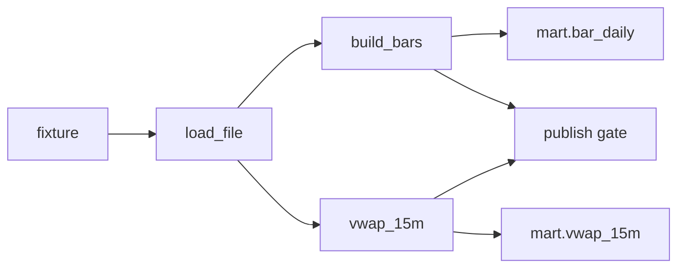

| File | What it checks |
|---|---|
| `test_bars.py` | Open = first, close = last, high/low = extrema; tie-break. |
| `test_vwap.py` | Trailing **time** window, not “last 15 rows”. Null when undefined. |
| `test_gate.py` | Which findings withhold a session from publish. |
| `test_capability.py` | Daily-only contract cannot invent VWAP. |
| `test_oracle.py` | Derived daily vs the vendor's own daily file. Needs the sample. Skips without it. |

The oracle is **not** an independent truth. It checks “agrees with this
vendor's daily file”, never “the price is correct”.

### `tests/demo/` — labelled defects

Question: when we plant defects for the demo, do we leave the source file
alone, and does the manifest name the rules that actually fire?

The base file `injection_base.csv` is clean on purpose. A dirty base would let
an injector that does nothing still pass.

### `tests/api/` — HTTP shapes

Question: does the route return the status, keys, and error `code` the spec
names?

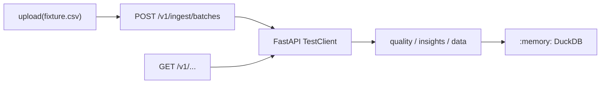

No TCP port. The database is already bootstrapped. These tests do **not**
cover “first start against an empty file” — that is integration.

| File | What it checks |
|---|---|
| `test_openapi.py` | `/v1` paths exist; no extra routes snuck in. |
| `test_ingest.py` | Upload 201, duplicate 409, no silent second copy. |
| `test_errors.py` | RFC 7807 problem body, same `code` vocabulary. |
| `test_dq.py` / `test_checks.py` | Summary and the four-card checks envelope. |
| `test_analytics.py` | Bars, VWAP, compare. |
| `test_insights.py` | Patterns and suggestions (no apply/dismiss keys). |
| `test_inventory.py` / `test_changelog.py` / `test_reference.py` | Contracts, changelog, calendar. |
| `test_findings_corroboration.py` | Confirmed / disputed / absent. |
| `test_purge_route.py` | HTTP side of purge. |

### `web/` — what the page draws

Question: given canned JSON, does the app show the right cards, table, and
refusals? Run it with `npm --prefix web test`.

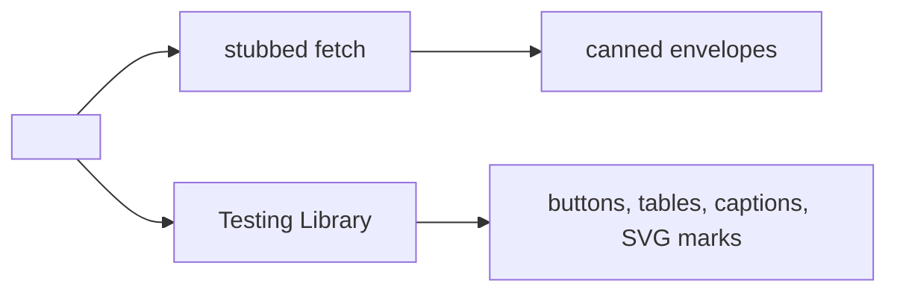

No DuckDB. No socket. If a page test needed a database it would be re-testing
quality. `fetch` is replaced globally in `src/test/setup.ts`, so a component
that reaches the network without a stub fails loudly instead of hanging.

| File | What it checks |
|---|---|
| `src/App.test.tsx` | Both destinations; Review assembly and order; the VWAP refusal; click-through; no apply control; failure states. |
| `src/charts/overlay.test.ts` | The bar↔mark join, the status vocabulary, chart identity, and series at real size. |
| `src/charts/Ohlcv.test.tsx` | The marks themselves, in the SVG: absent is dashed and never a zero bar; paint is `invalid` alone. |
| `src/components/DemoPanel.test.tsx` | Consent copy, the two separate buttons, coverage grouping, the CSV mark, streamed progress. |
| `src/api/schema.test.ts` | Stub parity against `/v1/openapi.json`. |

The stub-parity test is the guardrail: every canned key must exist on the
schema it stands in for. A stub written to match the page can only confirm the
page's own guesses — and it earned its place immediately, catching a `meta`
field the test data gave `VwapResponse` and the API never had.

It reads `src/api/schema.json`, which `npm --prefix web run types` pulls from a
running API. **When that file is absent the parity tests skip**, so a checkout
with no server can still run the suite; a skipped guard is visible in the
report, where a silently passing one would not be.

**What a page test cannot tell you.** Fixtures are small and real payloads are
not. Three defects in this tier's own subject reached a live pass unseen: a VWAP
window of 114,477 points that overflowed the stack, an inject/remove round trip
that reported a restore it had not done, and two contracts' data sharing one
screen mid-fetch. Each is now a test — but the live pass is what found them.

### `tests/integration/` — the joins

Question: does the documented start path work on a real file, over a real
port, with the same client the UI uses?

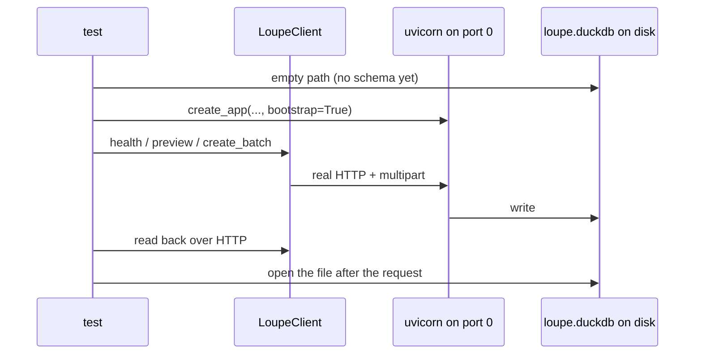

| File | Seam |
|---|---|
| `test_cold_start.py` | Empty store answers `degraded`, not a 500. Bootstrap makes it usable. |
| `test_walkthrough.py` | Preview commits nothing; upload is readable; durability after the request. |
| `test_demo_corpus.py` | CSV and Parquet mean the same thing; fetch failure is legible. |

These tests are few and slow. Behaviour stays in the faster folders.

---

## 7. The tiny CSV files

`tests/fixtures/` is a box of short, committed CSVs. Each file plants **one**
defect so a failure names the rule.

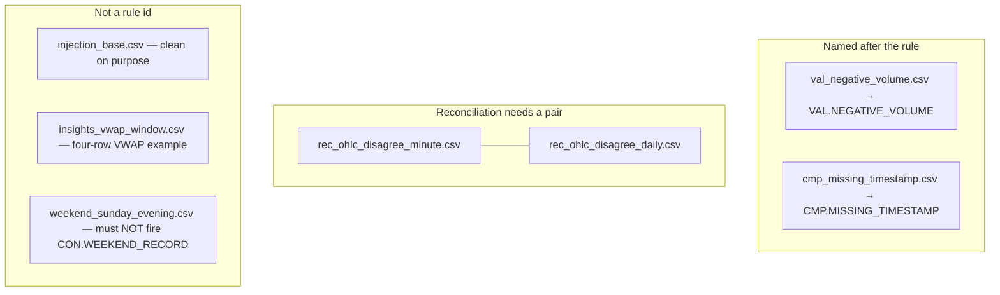

CSV rather than Parquet so a fixture change reads like any other diff.

The real vendor sample is the wrong unit-test fixture: it is large, not
committable, and too clean. Four of the seven `error` rules find nothing in it.

More naming rules: `tests/fixtures/README.md`.

---

## 8. Tests that need the vendor sample

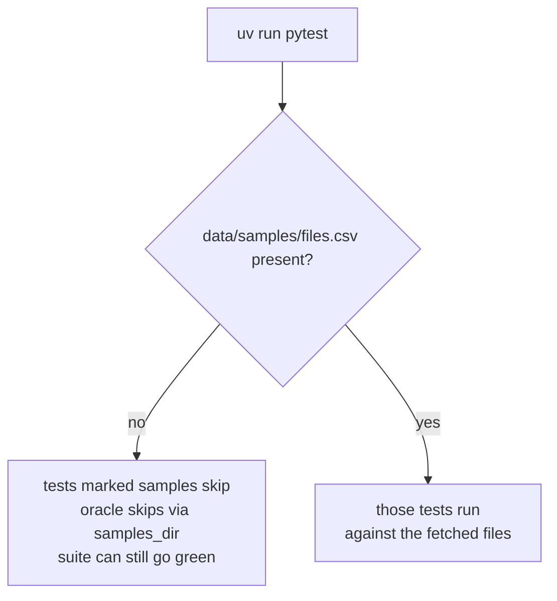

| Kind | How it opts in | Without the sample |
|---|---|---|
| Load / preview / seed checks | `@pytest.mark.samples` | Skip |
| Exclusion rate vs the live corpus | `@pytest.mark.samples` | Skip |
| Oracle (derived daily vs vendor daily) | `samples_dir` fixture | Skip |

CI never fetches the sample (no redistribution licence). Green CI means “the
committed fixtures pass”, not “the oracle ran”.

Fetch locally with `uv run python tools/fetch_samples.py` when you need that
tier.

---

## 9. Three rules that keep tests honest

These come from bugs that reached `main` with a green suite. Simple pictures:

**1. Test both sides of a filter.**

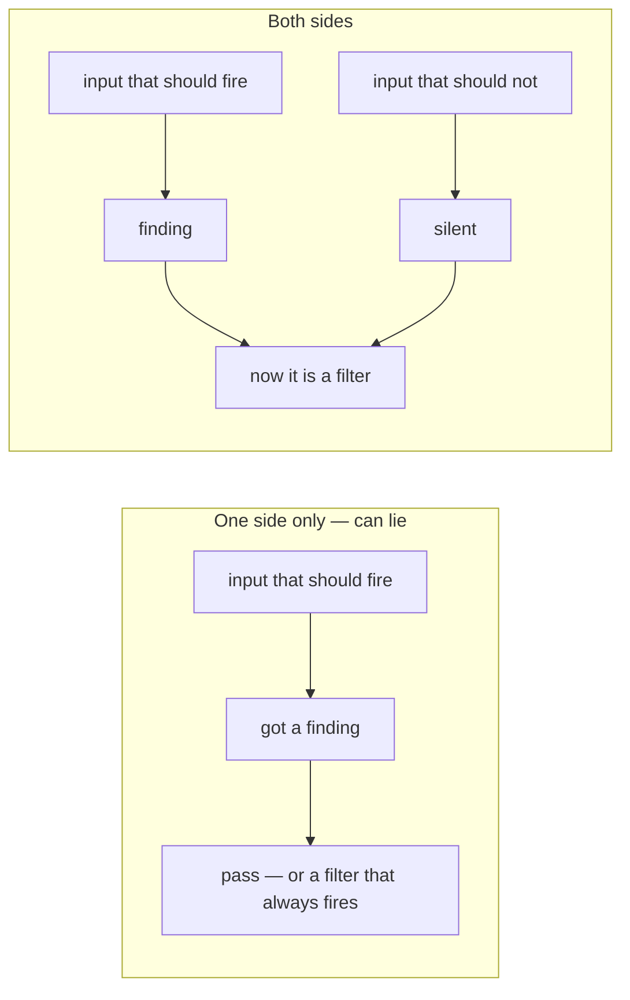

**2. Assert you entered the branch.**

A check inside `if rows:` proves nothing if `rows` is always empty. Also assert
you saw a row (or say this fixture is the quiet case, and use another for the
loud case).

**3. Build UI stubs from a real response, not from the page.**

Copy the API envelope. Then assert the stub's keys against the generated
OpenAPI document (`web/src/api/schema.test.ts`). A stub invented to match the
components will never catch a component that expects a field the API does not
send — and this is not hypothetical: the guard's first run found a `meta` key on
`VwapResponse` that only the stub had.

---

## 10. Where to put a new test

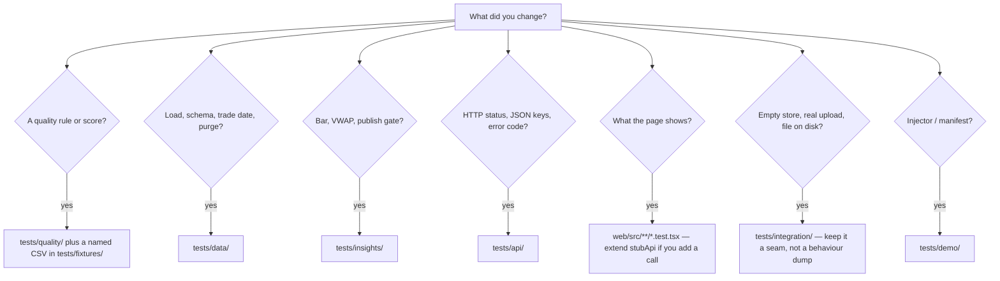

Name the test `test_<behaviour>`. Prefer a real in-memory DuckDB over mocking
SQL. Mock network I/O (the Hugging Face fetch), not the store.

If you add a UI envelope, add it to the stub-parity list in
`web/src/api/schema.test.ts`.

---

## 11. Commands

```bash
uv run pytest                          # whole suite (sample tests skip if missing)
uv run pytest tests/quality            # one folder
uv run pytest tests/quality/test_rules_validity.py -k negative_volume
uv run pytest -m samples               # only the corpus-gated tests
uv run pytest tests/integration        # real port + file; slower
```

```bash
npm --prefix web test                  # the UI tier: Vitest + Testing Library
npm --prefix web run types             # refresh schema.json from a running API,
                                       # which un-skips the stub-parity guard
```

CI: `.github/workflows/ci.yml` runs `uv run ruff check .` then `uv run pytest`.
A local hook does the same once you run `git config core.hooksPath .githooks`.
